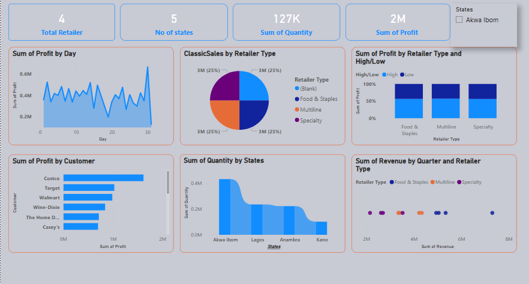

## ABOUT ME

*Hello, I'm **Peace Friday Daniel**, an aspiring Data Analyst passionate about transforming data into meaningful insights and actionable solutions. Through hands-on projects and continuous learning, I have developed strong analytical, problem-solving, and reporting skills. I also enjoy supporting and mentoring fellow learners, helping them grow in their data analytics journey. I am committed to leveraging data to solve real-world problems and contribute to informed decision-making.*

## WHAT I DO

**✅Analyze and interpret data to uncover insights.**

**✅Build interactive dashboards using Power BI and Excel.**

**✅Query and manage data using SQL.**

**✅Perform data cleaning and analysis with Python.**

**✅Support and mentor fellow learners in data analytics.**

## TOOLS
**Excel|**
**Power BI|**
**SQL|**
**Python**

## MY PROJECTS

A glimpse of some projects i worked on.
# Retail Sales Performance Dashboard

**Tool Used:** Power BI

## Business Problem

Retail businesses need a clear understanding of sales performance across customers, states, and retailer categories to make informed decisions. Analyzing large volumes of sales data manually can be time-consuming and inefficient.

## Project Description

Developed an interactive Power BI dashboard that provides insights into retail sales performance by customer, state, and retailer type. The dashboard enables users to monitor key business metrics and identify trends that impact profitability and revenue generation.

## Key Insights

* Akwa Ibom recorded the highest quantity sold among the displayed states.
* Costco emerged as the most profitable customer.
* Profit performance varied across retailer categories, highlighting differences in business contribution.
* Revenue distribution across quarters revealed opportunities for seasonal sales analysis.

## What I Learned

* Designing interactive dashboards in Power BI.
* Creating KPIs and visual reports for business users.
* Transforming raw sales data into actionable insights.
* Applying data visualization techniques to support decision-making.

