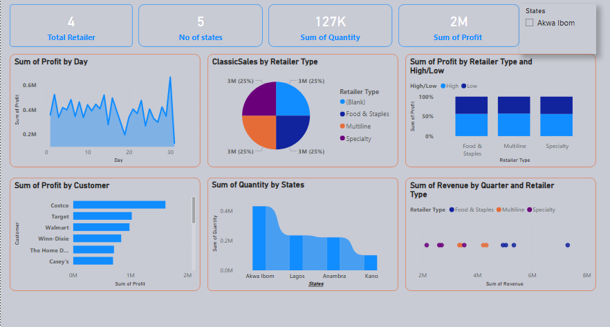
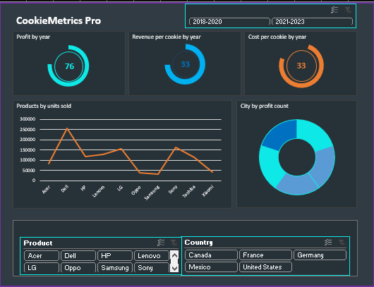
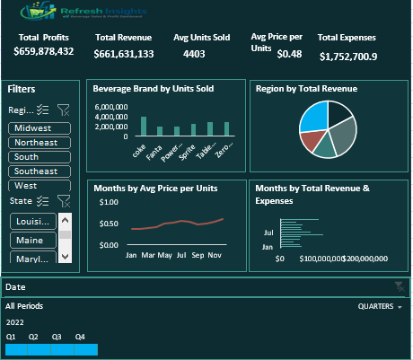

# Peace Friday Daniel | Aspiring Data Analyst

**Excel | Power BI | SQL | Python**

---

## ABOUT ME

Hello, I'm Peace Friday Daniel, an aspiring Data Analyst with hands-on experience in data cleaning, analysis, visualization, and reporting.

Through practical projects and continuous learning, I have developed experience using **Excel, Power BI, SQL, and Python** to explore data, create dashboards, and communicate insights clearly.

I also enjoy supporting fellow learners as they develop their technical skills and understanding of data analytics.

---

## WHAT I DO

- Analyze and interpret data to identify patterns and insights.
- Build interactive dashboards using **Power BI** and **Excel**.
- Write **SQL queries** to retrieve, filter, and analyze data.
- Perform data cleaning and analysis using **Python**.
- Support fellow learners in developing their data analytics skills.

---

## TOOLS & TECHNOLOGIES

| Tool | Skills |
|---|---|
| **Microsoft Excel** | Data cleaning, PivotTables, PivotCharts, Slicers, and dashboards |
| **Power BI** | Data visualization, interactive dashboards, and DAX |
| **SQL** | Data retrieval, filtering, joins, and aggregation |
| **Python** | Data analysis and data manipulation using Pandas and NumPy |

---

# MY PROJECTS

A selection of practical data analytics projects I have completed using Excel and Power BI.

---

## 1. Retail Sales Performance Dashboard

*Tool Used: Power BI*

### Business Problem

Retail businesses need a clear understanding of sales performance across customers, states, and retailer categories. Analyzing large volumes of sales data manually can be time-consuming.

### Project Description

Developed an interactive Power BI dashboard to analyze retail sales performance by customer, state, and retailer type. The dashboard presents key business metrics and visualizations that make it easier to explore sales and profit performance.

### Key Insights

- Akwa Ibom recorded the highest quantity sold among the displayed states.
- Costco recorded the highest profit among the displayed customers.
- Profit performance varied across retailer categories.
- Revenue distribution across quarters provided an opportunity to examine seasonal sales patterns.

### What I Learned

- Designing interactive dashboards in Power BI.
- Creating KPIs and visual reports.
- Transforming raw data into useful visual insights.
- Applying data visualization techniques to communicate findings clearly.

**[View Dashboard](YOUR_PROJECT_LINK_HERE)**

---

## 2. CookieMetrics Pro Dashboard

*Tool Used: Microsoft Excel*

### Business Problem

Businesses need a simple way to monitor product sales, revenue, costs, and profitability across different countries and product categories. Raw spreadsheets can make it difficult to identify trends and compare performance.

### Project Description

Built an interactive Excel dashboard to analyze product performance, profitability, and revenue trends across multiple countries. The dashboard uses **PivotTables, PivotCharts, and Slicers** to provide an interactive view of business performance.

### Key Insights

- Product sales volumes varied across different product categories.
- Revenue and cost metrics provided insight into overall profitability.
- Country-level analysis highlighted differences in market performance.
- Interactive filters allowed for quick comparison of products and regions.

### What I Learned

- Building interactive dashboards in Excel.
- Using PivotTables, PivotCharts, and Slicers for analysis.
- Presenting business data through clear visualizations.
- Creating KPI-focused reports for performance monitoring.

**[View Dashboard](YOUR_PROJECT_LINK_HERE)**

---

## 3. Refresh Insights – Beverage Brand Sales Dashboard

*Tool Used: Microsoft Excel*

### Business Problem

Beverage companies need visibility into sales performance, profitability, expenses, and regional trends to better understand business performance.

### Project Description

Developed an Excel dashboard to analyze beverage sales performance across brands and regions. The dashboard brings together revenue, profit, expenses, units sold, and pricing metrics in one reporting interface.

### Key Insights

- Revenue exceeded $661 million while reported profit approached $660 million in the dataset.
- Beverage brands differed in their unit sales performance.
- Revenue varied across regions, highlighting differences in market performance.
- Monthly average prices remained relatively stable with some fluctuations throughout the period analyzed.

### What I Learned

- Creating business-focused dashboards in Excel.
- Developing KPI cards and interactive filters.
- Analyzing sales and brand performance.
- Converting raw data into clear visual reports.

**[View Dashboard](YOUR_PROJECT_LINK_HERE)**

---

# TECHNICAL SKILLS

- **Data Analysis**
- **Data Cleaning & Transformation**
- **Data Visualization**
- **Dashboard Development**
- **Microsoft Excel**
- **Power BI & DAX**
- **SQL Querying**
- **Python Data Analysis**

---

# CONTACT

- **Email:** peacedanielfriday@gmail.com
- **Portfolio:** https://penguin-994bc6.my.canva.site
- **Location:** Nigeria
- **Availability:** Open to internship, entry-level, freelance, and collaboration opportunities
